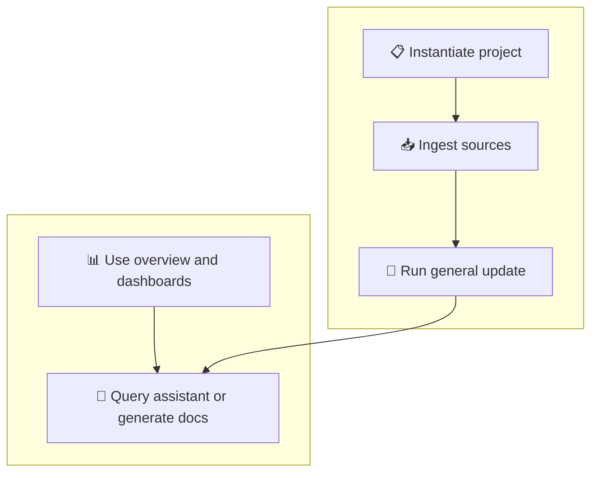

# Workspace Memory

This repository is the workspace root for one or more project context banks, shared human-facing dashboards, and agent resources.

## Human Guide

Use this repo as the project's engineering memory alongside day-to-day development.

- Intent: keep requirements, design rationale, decisions, verification evidence, and execution status in one traceable place.
- Action types: consult the project context before work, update the relevant artefacts as the design evolves, and keep summaries and change logs current during maintenance.

### Example workflow

1. **Instantiate the project** from the template, then customize the structure only where the project needs it.
2. **Ingest source information** such as notes, references, specs, or external documents to build the initial project memory.
3. **Run general updates** to connect requirements, design choices, decisions, risks, and verification artefacts.
4. **Query the assistant** against this repository memory, or ask it to produce internal documentation from the linked artefacts.
5. **Use the overview and dashboards** to spot gaps, improve information quality, and publish accessible status updates.
